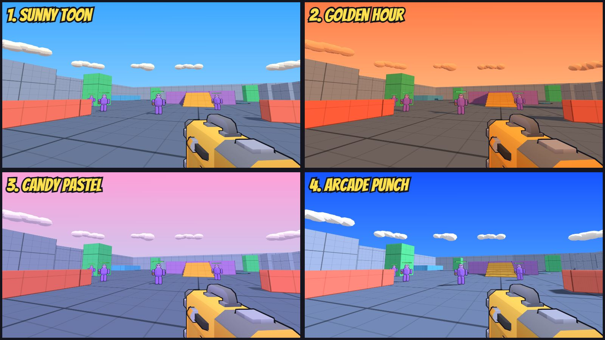

# Movement Shooter

A fast, arcade, cartoon-style movement shooter that runs in the browser (three.js, no build step).
Sprint, slide, wall-jump, get launched by jump pads and your own guns, and splat bean bots.



## Play locally

**Windows:** double-click `start.bat`. It starts a small local server and opens the game at
http://localhost:5173. Keep the window open while you play.

**Any OS:** `python serve.py`, then open http://localhost:5173.

(Python 3 is required for the local server. The game itself loads three.js from a CDN, so you
need an internet connection the first time.)

## Multiplayer (work in progress)

### Play with friends anywhere (easiest)

1. Install [Node.js](https://nodejs.org) (LTS) on the PC that hosts.
2. Double-click `host-online.bat`. The first run downloads Cloudflare's free `cloudflared` tunnel
   program (about 55 MB) into `server/bin/`.
3. Wait for **Server is ONLINE**. A join link like
   `https://kierbob.github.io/MovementShooter/?server=something.trycloudflare.com` is printed and
   copied to your clipboard. Send it to your friends and open it yourself too.
4. Keep the window open while you play. The address changes every time you restart it.

Friends need nothing installed; they just open the link.

### Local / LAN only

1. Install [Node.js](https://nodejs.org) (LTS) on the PC that hosts.
2. Double-click `start-server.bat` (first run installs the one dependency). The server listens on
   port **8080**.
3. Start the game (`start.bat`), click the mode card → **Multiplayer**, set your name, and set the
   server to `localhost:8080` (or `<host PC's LAN IP>:8080` for friends on the same Wi-Fi).
4. Press Play.

Join links: `…/index.html?server=your-server-address` opens straight into Multiplayer.

Current state: free-for-all with real combat. The server runs the same movement + weapon code
as the game (authoritative), with lag-compensated hits, client prediction + reconciliation, health,
deaths, respawns, a kill feed and a Tab scoreboard. Next: match flow (score limit, timer).

## Modes

- **Dev Server**: movement sandbox with bean dummies, jump pads, and **time trial** portals
  (guns on / guns off) with best times.
- **Bot Arena**: free-for-all against bean bots that fight back. Easy / Normal / Hard.

## Default controls (all rebindable in Settings)

| Action | Key |
|---|---|
| Move | W A S D |
| Jump / wall jump | Space |
| Sprint | Left Shift |
| Crouch | Left Ctrl |
| Slide | C |
| Fire | Left mouse |
| Reload | R |
| Primary / secondary | 1 / 2 (or mouse wheel) |
| Ability | Q |
| Menu | Esc or L |
| Respawn / restart trial | K |
| Stats panel (full / compact / off) | F4 |

## Project layout

```
index.html          entry point
serve.py, start.bat local dev server (no-cache)
src/
  config.js         all movement tuning numbers
  player.js         movement simulation (no three.js — reusable on a server)
  combat.js         weapons, projectiles, damage, hitboxes
  bots.js           bean bot AI
  items.js          weapon & ability definitions
  world.js          map layout (boxes, pads, arena, time trial)
  render.js         renderer, lighting presets, sky
  fx.js             visual effects, viewmodel, bean models
  hud.js / menu.js  UI
  sound.js          synthesized cartoon sound effects
assets/models/      glTF models
```

## Credits

- Weapon models: [Kenney Blaster Kit](https://kenney.nl/assets/blaster-kit) (CC0) —
  see `assets/models/weapons/KENNEY_LICENSE.txt`
- Rendering: [three.js](https://threejs.org) (MIT), loaded from jsDelivr
- Fonts: Bangers & Bebas Neue (Google Fonts, SIL Open Font License)
